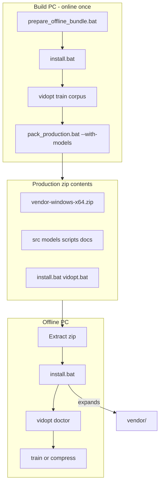

# vidopt — System Guide

A deep explanation of how **vidopt** works: what problem it solves, how train mode
and compress mode fit together, how parameter search and models behave, and how the
**offline Windows** packaging workflow is designed.

**Audience:** operators deploying offline, and developers extending the pipeline.

**Related docs:**

| Doc | Purpose |
|---|---|
| [START_HERE.txt](START_HERE.txt) | Shortest command cheat sheet |
| [README.md](README.md) | Overview and quick start |
| [USAGE.md](USAGE.md) | Step-by-step install, train, compress |
| [OFFLINE_GUIDE.md](OFFLINE_GUIDE.md) | Windows offline pack, extract, repair |
| [COMPRESS_GUIDE.md](COMPRESS_GUIDE.md) | Compress-only production package |
| [REPAIR.txt](REPAIR.txt) | Offline repair checklist |

---

## Table of contents

1. [What problem vidopt solves](#1-what-problem-vidopt-solves)
2. [Architecture overview](#2-architecture-overview)
3. [Core concepts](#3-core-concepts)
4. [Train mode (phase 1)](#4-train-mode-phase-1)
5. [Parameter search](#5-parameter-search)
6. [Machine learning models](#6-machine-learning-models)
7. [Compress mode (phase 2)](#7-compress-mode-phase-2)
8. [Resume and checkpointing](#8-resume-and-checkpointing)
9. [Offline Windows deployment](#9-offline-windows-deployment)
10. [Directory layout and artifacts](#10-directory-layout-and-artifacts)
11. [Configuration](#11-configuration)
12. [Command reference](#12-command-reference)
13. [Operational guidance](#13-operational-guidance)
14. [Troubleshooting](#14-troubleshooting)

---

## 1. What problem vidopt solves

Standard video encoders expose many knobs — CRF, adaptive quantization (AQ) mode and
strength, preset, and more. The **best** settings depend on **what the scene looks like**:
grainy dark footage, flat animation, and high-motion sports need different parameters to
hit the same quality target at the smallest file size.

**vidopt** automates this in two phases:

| Phase | Command | Network? | Typical duration |
|---|---|---|---|
| **Train** | `vidopt train CORPUS...` | No (after setup) | Hours (once per corpus + encoder) |
| **Compress** | `vidopt compress IN -o OUT` | No | Minutes per video |

**Train** measures quality (VMAF) on many encode trials, learns a mapping from scene
features → encoder settings, and saves **model bundles** under `models\`.

**Compress** never measures VMAF in the hot path (unless you pass `--verify`). It splits
the input at scene cuts, predicts settings per segment, encodes in parallel, and
concatenates with `-c copy` so chosen parameters survive into the final file.

This project targets **offline Windows** production: bundle Python, ffmpeg, and models
into zips; deploy without internet; run `install.bat` once after extract.

---

## 2. Architecture overview

```
                    TRAIN (once)                         COMPRESS (many)
                    ------------                         ---------------

  corpus videos          input video
       |                      |
       v                      v
  scene segmentation    scene segmentation
       |                      |
       v                      v
  feature extraction    feature extraction   (same 8-D vector per segment)
       |                      |
       v                      v
  parameter SEARCH      model PREDICT        (crf, aq_mode, aq_strength)
  (encode + VMAF)            |
       |                      v
       v                 parallel encode
  train ML models            |
       |                      v
       v                 lossless concat  -->  output.mp4
  models/<encoder>/
```

**Key design choices:**

- **Scene-adaptive:** each segment gets its own parameters; cuts are detected with
  PySceneDetect (or fixed-length fallback when no cuts exist).
- **Quality floor:** optimization targets a VMAF threshold (e.g. 89), not average
  quality — missing the floor scores zero in the objective.
- **Encoder-specific models:** a CRF of 28 means different things for x265, SVT-AV1, and
  NVENC; train and compress must use the **same `--encoder`**.
- **Trial cache:** every encode+VMAF measurement in search is stored in SQLite so resume
  and re-runs are cheap.

---

## 3. Core concepts

### 3.1 Segments

Long videos are split at **scene cuts** (configurable thresholds in `segment.*`). Each
segment is a short `.mkv` file (Matroska tolerates stream-copied cuts well).

Bounds (`min_segment_seconds`, `max_segment_seconds`) keep segments long enough to
encode efficiently but short enough for parallelism and stable statistics.

If no cuts are detected, the pipeline falls back to fixed-duration chunks
(`fallback_segment_seconds`).

### 3.2 VMAF

**VMAF** (Video Multimethod Assessment Fusion) estimates perceptual quality vs. a
reference. vidopt uses **`vmaf_v0.6.1neg`** by default — resistant to sharpening tricks
that inflate scores without real fidelity.

During **search**, frames may be subsampled (`vmaf.n_subsample_search`, default 2) for
speed. **`--verify`** on compress uses full measurement (`n_subsample_verify: 1`).

Pooling uses the **harmonic mean** over frames — bad frames drag the score down heavily,
which matches a “quality floor” requirement.

### 3.3 Encoder parameters

For CPU encoders (x265, x264, SVT-AV1), search optimizes three knobs per segment:

| Parameter | Role |
|---|---|
| **CRF** | Primary rate–quality dial; higher CRF → smaller file, lower VMAF |
| **aq_mode** | Adaptive quantization mode (encoder-specific discrete set) |
| **aq_strength** | AQ intensity (integer or float grid depending on encoder) |

**CRF is monotone:** at fixed AQ, VMAF falls as CRF rises. That enables a **1-D search**
(bisection / Brent / golden section) once AQ is fixed.

**AQ is low-dimensional:** e.g. 8 `(mode, strength)` pairs on SVT-AV1 — practical to
enumerate or walk neighbors.

### 3.4 Objective function

The score in `[0, 1]` balances compression and quality:

- **Zero score** if VMAF `< target − 5` or if the file barely shrank (`rate ≥ 0.80`).
- **Above target:** ~70% weight on compression, ~30% on quality headroom.

Search therefore asks: *What is the **highest CRF** (smallest file) that still reaches
VMAF ≥ target?*

See `src/vidopt/scoring.py` for the exact mathematics.

### 3.5 Quality levels (`--level`)

CLI shorthand for VMAF targets:

| `--level` | VMAF target |
|---|---|
| `1` | 85 |
| `2` | 89 |
| `3` | 93 |

Train and compress should use the same level (or explicit `--target` on compress).

### 3.6 Features (8-D vector)

Each segment is summarized before search or prediction:

| Feature | Meaning |
|---|---|
| `spatial_information` | Spatial complexity (SI) |
| `temporal_information` | Temporal complexity (TI) |
| `motion_p95` | Peak motion between frames |
| `duration` | Segment length (seconds) |
| `luma_mean`, `luma_std` | Brightness statistics |
| `color_complexity` | Chroma / colour variation |
| `log_pixels` | Resolution prior |

**Important:** `features.analysis_width` must match between train and compress. Changing
it invalidates trained models.

---

## 4. Train mode (phase 1)

Command:

```bat
vidopt.bat train video\corpus --config cpu --encoder libsvtav1 --level 2 --cpu-workers 0 --resume
```

CLI `train` injects **`search.strategy=boundary`** by default (good match for VMAF-floor
training). Override with `--set search.strategy=...`.

### Stage 1 — Segment corpus

- Discovers videos under the corpus path (recursive; `.mp4`, `.mkv`, `.mov`, etc.).
- Probes each source with ffprobe; cuts at scene boundaries.
- Writes `runs\<work_dir>\segments.json` — manifest of all segment files.
- With **`--resume`**, reuses segments from the manifest; only re-segments missing sources.

### Stage 2 — Hash segments

- Computes a **content hash** per segment file for the trial cache key.
- Same bytes → same cache entry even if the path changed.

### Stage 3 — Search parameters

For **each segment** × **each VMAF target** (from `--level` or `search.targets`):

1. **Explore** `(crf, aq_mode, aq_strength)` (strategy-dependent budget).
2. **Refine** with a 1-D CRF solve at the best AQ setting(s).
3. Record the best feasible trial (highest compression at VMAF ≥ target).

Workers run in parallel (`--cpu-workers`; `0` = auto from CPU count). Each trial:

```
encode segment → measure VMAF vs. source → score → cache in SQLite
```

Checkpoints: one JSON line per finished segment in
`runs\<work_dir>\search_records.jsonl`.

This stage dominates runtime (hours on a large corpus).

### Stage 4 — Train models

- Builds `runs\<work_dir>\dataset.csv` — one row per (segment, target) with features,
  labels `(crf, aq_mode, aq_strength)`, and metadata.
- Trains **three heads** per target (HistGradientBoosting by default):
  - CRF regressor (quantile loss — see §6)
  - AQ mode classifier
  - AQ strength regressor
- Writes bundles to `models\<encoder>\target_<T>\` (`metadata.json`, `*.joblib`).

Infeasible segments (cannot reach target at any CRF) are excluded from training.

---

## 5. Parameter search

Search runs **only in train mode**. Compress never re-searches.

### Two stages (all strategies)

```
Stage A — explore:  propose (crf, AQ) points until budget (search.n_explore)
Stage B — refine:   1-D CRF solve at best AQ for each VMAF target
```

Trials are cached in `runs\cache\trials.sqlite` keyed by segment hash + params + VMAF
model — not by file path.

### Strategies (`search.strategy`)

| Strategy | CLI default? | Idea |
|---|---|---|
| **`boundary`** | **Yes** (`vidopt train`) | Screen AQ, then threshold-first neighbor walk; **re-solves CRF** at each neighbor and compares by real constrained score |
| **`aq_then_crf`** | Config file default | Enumerate AQ, screen at few CRFs, full CRF solve on best AQ |
| **`coordinate`** | | Same screen, then hill-climb AQ neighbors on the grid |
| **`sample`** | | 3-D space-filling design (Sobol/LHS/Halton), then CRF solve |
| **`bayes`** | | Gaussian-process proposals (research) |
| **`tpe`** | | Tree-structured Parzen Estimator |
| **`cmaes`** | | Diagonal evolution strategy |

### CRF solvers (`search.crf_solver`)

At fixed AQ, find the **highest CRF** still meeting VMAF:

| Solver | Behavior |
|---|---|
| **`bisect`** (default) | Secant step between bracket endpoints |
| **`brent`** | Inverse-quadratic interpolation — fewer encodes when smooth |
| **`golden`** | Golden-section — robust when VMAF is noisy |

### When to change strategy

- **Production:** keep CLI default **`boundary`** or use **`aq_then_crf`**.
- **x265 float AQ interactions:** try **`coordinate`**.
- **Research / comparison:** **`sample`**, **`bayes`**, **`tpe`**, **`cmaes`**.

Changing strategy requires a new search pass (or `--resume` on an incomplete one).

Full catalog and examples: [USAGE.md §2.4](USAGE.md#24-search-algorithms).

---

## 6. Machine learning models

### 6.1 What gets learned

For each **encoder** and **VMAF target**, a **bundle** predicts:

```
features (8-D)  →  crf, aq_mode, aq_strength
```

At compress time, optional **`vmaf_target`** is appended for models trained with that
feature (see bundle metadata).

### 6.2 Why quantile loss on CRF (`model.crf_quantile`)

Search labels sit **on the quality boundary** (highest CRF that still hits target). The
objective punishes undershooting VMAF far more than overshooting. Whole-file VMAF is a
**harmonic mean** over segments — one bad segment hurts disproportionately.

Default **`crf_quantile: 0.15`** fits CRF **below** the median searched value, building
~1 CRF of safety margin. If `--verify` often reports **MISSED**, lower it (e.g. `0.10`)
and re-run train with **`--resume`** after search is complete (skips search, refits only).

### 6.3 Metrics that matter

`vidopt inspect` reports:

| Metric | Meaning |
|---|---|
| **hit rate** | Fraction of held-out segments where predicted params would still meet target |
| **CRF MAE** | Mean absolute error on CRF labels |

**Prioritize hit rate over R².** A model can have good R² but frequently miss the VMAF
floor — which scores zero in production.

Aim for **≥ 95% hit rate** before deploying.

### 6.4 Training domain

Models interpolate well within the feature ranges seen in the corpus and **extrapolate
poorly** outside. Compress warns when input resolution, fps, or other features fall
outside training ranges — verify with `--verify` and add similar content to the corpus if
needed.

---

## 7. Compress mode (phase 2)

Command:

```bat
vidopt.bat compress input.mp4 -o out\out.mp4 --encoder libsvtav1 --level 2 --verify --resume
```

### Pipeline

1. **Segment** input at scene cuts (same logic as train).
2. **Extract features** per segment (same 8-D vector).
3. **Load model bundle** for `models\<encoder>\target_<T>\`.
4. **Predict** `(crf, aq_mode, aq_strength)` per segment.
5. **Encode** segments in parallel across the worker pool.
6. **Concatenate** video with `-c copy`; **graft audio** from the original (bit-exact).

### Preserved from the source

Audio, subtitles, chapters, bit depth (when supported), chroma subsampling, pixel aspect
ratio, duration, and frame count.

### `--verify`

Re-encodes are not needed — verification measures the **final muxed output** against the
original. Reports size ratio, VMAF, score, and `[OK]` / `[MISSED]` vs. target.

### `--resume`

If compress is interrupted, `--resume` reuses intermediate segment files already encoded
in the work directory.

---

## 8. Resume and checkpointing

Training can run for hours. Safe to stop with **Ctrl+C**.

| Artifact | Purpose |
|---|---|
| `runs\<work_dir>\segments.json` | Scene cuts — reused on `--resume` |
| `runs\<work_dir>\search_records.jsonl` | One line per **finished** segment search |
| `runs\cache\trials.sqlite` | Every encode+VMAF trial (cross-run cache) |

**With `--resume`:**

1. Reuses existing segments from `segments.json`.
2. Skips segments already in `search_records.jsonl` for the same **encoder + VMAF target**.
3. Still hits SQLite for individual trials (partial segment searches benefit too).

**Without `--resume`**, search runs again for every segment (SQLite still avoids
re-encoding identical trials).

Always re-run the **same command** with `--resume`:

```bat
vidopt.bat train video\corpus --config cpu --encoder libsvtav1 --level 2 --cpu-workers 0 --resume
```

Target keys normalize as `"89"` not `"89.0"` so resume matching is stable.

---

## 9. Offline Windows deployment

This build is **Windows-only**, **CLI-only**, designed for **air-gapped** machines.

### 9.1 Build machine (online, once)

```bat
scripts\prepare_offline_bundle.bat
install.bat
vidopt.bat train video\corpus --encoder libsvtav1 --level 2 --cpu-workers 0 --resume
scripts\pack_production.bat --with-models
```

**`prepare_offline_bundle.bat`** downloads:

- Python 3.11 embed + installer + get-pip → `vendor\installers\`
- Pinned wheels → `vendor\wheelhouse\`
- ffmpeg with libvmaf → `vendor\ffmpeg\` (or copy from `VIDOPT_FFMPEG_DIR`)

Then runs **`install.bat`** to populate `vendor\python\` with libraries + vidopt.

### 9.2 Two-step compression (production zip)

**`pack_production.bat`** does not ship a raw `vendor\` folder. It:

1. **Compresses** `vendor\` → `vendor-windows-x64.zip`
2. **Compresses** the project tree **including** that zip (not the expanded vendor tree)

Output: `dist\vidopt-offline-windows-x64.zip`  
Also writes: `dist\vendor-windows-x64.zip` (same vendor archive, standalone copy)

### 9.3 Offline PC (first run)

```bat
rem Extract dist\vidopt-offline-windows-x64.zip
cd vidopt-offline-windows-x64
install.bat
vidopt.bat doctor
vidopt.bat train video\corpus ... --resume
vidopt.bat compress in.mp4 -o out\out.mp4 --encoder libsvtav1 --level 2 --verify
```

**`install.bat`** on first run:

1. Detects `vendor-windows-x64.zip` in the project root.
2. Extracts it → `vendor\` (Python, ffmpeg, wheelhouse, installers).
3. Installs / refreshes vidopt from `src\vidopt` into bundled Python.
4. Runs `vidopt doctor`.

No network. Run **`install.bat`** again only for **repair** — see [REPAIR.txt](REPAIR.txt).

### 9.4 Other packages

| Script | Output | Use case |
|---|---|---|
| `pack_production.bat --with-models` | Full offline train + compress | Primary deployment |
| `pack_project.bat --with-models` | Full project + embedded vendor (+ optional corpus) | Backup / transfer |
| `pack_compress.bat` | Compress-only (models + runtime) | Production PC, no training |

### 9.5 Size expectations (approximate)

| Item | Size |
|---|---|
| `vendor-windows-x64.zip` | 700–900 MB |
| Production zip (no corpus) | 650–950 MB |
| Project zip with corpus (~68 clips) | 1.6–2.0 GB |
| `runs\` training scratch | ~1× corpus size (not shipped) |

---

## 10. Directory layout and artifacts

### Project root (development or extracted zip)

```
vidopt/
  vendor-windows-x64.zip   embedded runtime (before install.bat)
  vendor/                  created by install.bat (extract + repair)
    python/                bundled Python 3.11 + site-packages
    ffmpeg/bin/            ffmpeg + ffprobe (libvmaf)
    wheelhouse/            offline pip wheels (repair)
    installers/            Python embed zip, .exe, get-pip.py
  src/vidopt/              application source (copied into Python by install.bat)
  models/                  trained bundles (after train)
    libsvtav1/
      target_89/
        metadata.json
        crf.joblib
        aq_mode.joblib
        aq_strength.joblib
  runs/
    current/               default work_dir
      segments.json
      search_records.jsonl
      dataset.csv
      logs/
    cache/
      trials.sqlite        global trial cache
  video/corpus/            training videos (local copy, no network)
  out/                     compressed outputs
  vidopt.bat               launcher
  install.bat              first-run setup + repair
  scripts/                 pack / prepare helpers
  dist/                    created zip outputs
```

### Model bundle (`metadata.json`)

Records encoder name, VMAF target, feature names/ranges, training sources, metrics
(hit rate, MAE), and schema version. `vidopt inspect` reads these.

---

## 11. Configuration

Layering order (later wins):

```
built-in default.yaml  →  --config overlay  →  --set key=value
```

Shipped overlays (`src/vidopt/configs/`):

| Overlay | Purpose |
|---|---|
| **`cpu`** | CPU encoders, no CUDA |
| **`gpu`** | NVENC + optional CUDA VMAF |
| **`quick`** | Fast smoke test — not for deployment |

Common overrides:

```bat
vidopt.bat train video\corpus --config cpu --encoder libsvtav1 --level 2 ^
  --set paths.work_dir=runs/production ^
  --set jobs.cpu_workers=4 ^
  --set model.crf_quantile=0.10 ^
  --resume
```

Inspect effective config:

```bat
vidopt.bat config
vidopt.bat config --list-overlays
```

---

## 12. Command reference

| Command | Purpose |
|---|---|
| `vidopt doctor` | Toolchain check; encodes one frame per encoder |
| `vidopt train CORPUS...` | Segment → search → train |
| `vidopt compress IN -o OUT` | Predict → encode → concat |
| `vidopt inspect` | List models and metrics |
| `vidopt score --vmaf V --ratio R` | Evaluate objective directly |
| `vidopt config` | Print effective JSON config |

**Shared flags:** `--encoder`, `--level`, `--cpu-workers`, `--gpu-workers`, `--config`,
`--set`, `--log-level`, `--resume`.

**Pack / setup scripts:**

| Script | Purpose |
|---|---|
| `scripts\prepare_offline_bundle.bat` | Download offline installables |
| `install.bat` | Extract vendor zip + install vidopt |
| `scripts\pack_production.bat` | Production offline zip |
| `scripts\pack_project.bat` | Full project backup zip |
| `scripts\pack_compress.bat` | Compress-only zip |
| `python scripts\setup.py` | Dev install + ffmpeg fetch |

---

## 13. Operational guidance

### Corpus design

Train on content **like production**:

- Same **resolutions** you will deploy on.
- Mix motion types: static, action, grain, dark, animation, screen content.
- **10+ source videos** minimum; more diversity improves generalization.

Copy videos locally (USB, disk). No network on the training machine.

### Encoder choice

| Encoder | Kind | Notes |
|---|---|---|
| `libsvtav1` | CPU | Strong compression; coarser AQ grid |
| `libx265` | CPU | Default in config; rich AQ |
| `libx264` | CPU | Faster, less efficient |
| `hevc_nvenc` | GPU | Fast; needs NVIDIA |
| `av1_nvenc` | GPU | Ada+ GPUs |

Train and compress with the **same `--encoder`**.

### Typical end-to-end timeline

1. **Prepare bundle** (online, once) — tens of minutes.
2. **Train** (offline, hours) — dominated by search stage 3.
3. **Pack** (minutes) — `pack_production.bat --with-models`.
4. **Deploy** — copy zip to offline PC, extract, `install.bat`.
5. **Compress** (minutes per video) — no search, optional `--verify` for QA.

### Re-tuning without re-search

After search completes, change `model.crf_quantile` and re-run **`train ... --resume`**
— search is skipped; only model fitting runs again.

---

## 14. Troubleshooting

| Symptom | Likely cause | Action |
|---|---|---|
| `libvmaf` missing | Wrong ffmpeg | Restore `vendor\ffmpeg\bin\`; run `install.bat` |
| `vidopt` import error | Broken Python env | `install.bat` |
| Search very slow | Expected | Trial cache + `--resume`; reduce corpus or use `--limit` |
| Resume skips 0 segments | Different encoder/level | Same `--encoder` and `--level` as original run |
| `--verify` MISSED | Extrapolation or aggressive CRF | Check domain warning; lower `crf_quantile`; add corpus |
| Low hit rate in inspect | Corpus mismatch | Add production-like clips; re-train |
| Out of memory (4K) | Too many workers | `--cpu-workers 2` |
| `vendor` missing after extract | Skipped install | Run **`install.bat`** |

Full repair paths: [REPAIR.txt](REPAIR.txt), [OFFLINE_GUIDE.md §13](OFFLINE_GUIDE.md#13-repair-damaged-or-missing-files).

---

## End-to-end diagram (offline deployment)



---

*vidopt — scene-adaptive offline video compression. Windows CLI build.*
